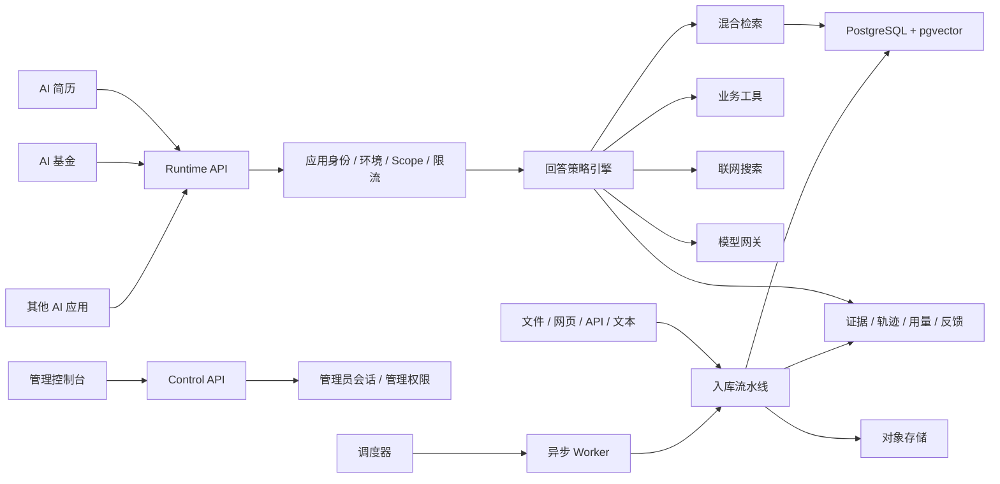
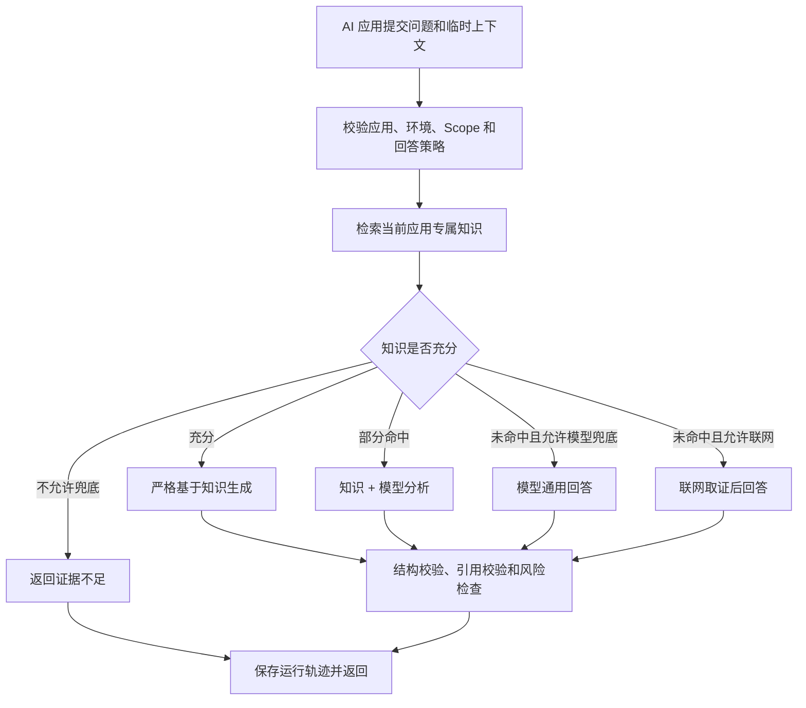

# AI 知识能力底座 PRD

| 项目 | 内容 |
| --- | --- |
| 产品名称 | AI 知识能力底座（AI Knowledge Core） |
| 文档版本 | V2.0 |
| 文档日期 | 2026-08-11 |
| 文档状态 | 全量改写实施基线 |
| 首个接入项目 | AI 简历 |
| 后续接入项目 | AI 基金及其他 AI 应用 |
| 权威性 | 本文件是项目唯一有效 PRD，历史 PRD 不再作为需求依据 |

## 1. 产品概述

### 1.1 产品定位

AI 知识能力底座是一套面向多个 AI 应用的统一知识、检索、回答、工具和运行治理平台。

AI 简历、AI 基金及未来 AI 项目继续维护各自的用户、页面和业务数据；它们通过标准 API 调用本平台，获得项目专属知识和 AI 回答能力。平台不替代业务系统，而是成为所有 AI 项目共同依赖的知识与回答基础设施。

平台的核心回答原则是：

> 优先使用当前 AI 项目的专属知识；知识部分命中时结合知识和模型分析；知识完全未命中时，根据回答策略允许模型使用通用能力独立回答；所有结果必须说明答案来源、引用、置信度和降级情况。

### 1.2 产品愿景

让一个新的 AI 项目不再重复建设文档解析、知识入库、向量检索、模型调用、来源引用、错误处理和调用审计，只需完成以下步骤即可获得可用的 AI 能力：

1. 创建应用空间和环境。
2. 导入该应用的专属知识。
3. 配置检索策略和回答策略。
4. 创建 API Key。
5. 调用 `/retrieve` 或 `/answer`。

### 1.3 核心价值

- 对业务项目：用稳定 API 获得知识增强的 AI 能力，不感知切割、向量和模型供应商细节。
- 对平台管理员：统一管理知识、模型、工具、错误、成本和调用质量。
- 对最终用户：回答能够区分知识事实、模型推断、联网信息和证据不足，降低幻觉与误导。
- 对后续开发：AI 简历、AI 基金等项目共享底座能力，但数据、权限和业务规则严格隔离。

## 2. 建设背景与问题

现有系统已经验证了项目隔离、知识库、混合检索、网页采集、异步任务、工具和研究链路的可行性，但产品形态仍然偏向数据库管理后台，无法作为长期 AI 底座继续扩展。

V2 需要解决以下问题：

1. 业务项目接入时需要理解过多底层概念，缺少稳定、简单的运行时接口。
2. 知识命中、部分命中和未命中没有形成明确的回答策略。
3. 前端错误主要以短暂提示出现，请求失败容易被误认为暂无数据。
4. 后端请求 ID、证据、任务、模型和成本信息没有形成统一运行轨迹。
5. 文档上传成功不等于知识可用，缺少完整的版本化入库状态。
6. 管理接口与业务调用接口边界不清晰。
7. 页面按技术表结构平铺，无法体现知识健康、AI 能力和业务接入状态。
8. 继续在旧结构上叠加功能会增加契约不一致和维护成本。

因此 V2 采用全量改写方案：重新建设产品模型、前端、后端模块和公开 API；旧系统仅作为数据迁移来源和实现经验参考。

## 3. 产品目标与非目标

### 3.1 V2 目标

1. 建立应用和环境级强隔离，杜绝跨项目、跨环境知识泄漏。
2. 建立文件、网页、文本和 API 数据的统一入库流水线。
3. 建立可配置的混合检索能力，并返回可定位的知识引用。
4. 建立回答策略引擎，支持知识回答、混合回答、模型兜底、联网回答和拒绝回答。
5. 为 AI 简历提供首个完整接入样板。
6. 为 AI 基金预留严格的数据时效、证据和风险策略。
7. 建立控制面与运行面分离的标准 API。
8. 建立统一错误中心、运行轨迹、反馈评估和成本统计。
9. 建立可迁移、可回滚、可测试的全量改写上线流程。

### 3.2 V2 第一阶段不做

- 不做多组织 SaaS、套餐、支付和账单系统。
- 不做公共知识库和跨应用知识共享。
- 不做复杂多 Agent 自主循环。
- 不做可视化工作流编排器。
- 不做插件市场。
- 不执行用户提交的任意代码。
- 不自动投递简历。
- 不自动执行基金买卖。
- 不把临时传入的个人简历默认沉淀为长期知识。
- 不用模型通用知识伪造实时行情、最新政策或确定性事实。

## 4. 核心概念

### 4.1 应用空间 Application

一个应用空间对应一个独立 AI 项目，例如：

- `ai-resume`
- `ai-fund`
- `ai-ecommerce`

应用空间是数据、知识、配置、工具、密钥和运行记录的最高隔离边界。

### 4.2 环境 Environment

每个应用空间支持：

- `development`
- `testing`
- `production`

同一应用不同环境的知识、模型配置、API Key 和运行日志互相隔离。

### 4.3 知识集合 Knowledge Collection

知识集合是具有统一用途、权限和更新策略的知识容器。

AI 简历示例：

- 简历写作规范。
- 岗位能力模型。
- 行业与公司知识。
- 面试知识。

AI 基金示例：

- 投资基础知识。
- 风险规则。
- 基金研究材料。
- 政策与合规资料。

### 4.4 数据源 Source

数据源统一表达知识从哪里进入平台：

- 文件上传。
- 网页地址。
- 网站采集。
- 手动文本。
- 外部 API。
- 业务系统同步。

### 4.5 检索策略 Retrieval Profile

检索策略定义：

- 可使用的知识集合。
- 全文与向量检索权重。
- Top K。
- 分数阈值。
- 元数据过滤。
- 文档去重。
- 是否重排。
- 最大上下文长度。

### 4.6 回答策略 Answer Profile

回答策略是 V2 的核心产品对象，定义一个 AI 能力如何回答：

- 使用哪个检索策略。
- 使用哪个模型。
- 使用哪个提示词和输出 Schema。
- 知识不足时是否允许模型兜底。
- 是否允许联网补充。
- 可调用哪些业务工具。
- 最小证据要求。
- 数据新鲜度要求。
- 超时和降级规则。
- 风险提示规则。

示例：

- `resume_job_match`
- `resume_optimize`
- `resume_interview_prepare`
- `fund_portfolio_analysis`
- `fund_risk_analysis`
- `general_knowledge_answer`

### 4.7 临时上下文 Request Context

临时上下文是业务项目在一次请求中传入的数据，例如用户简历、目标 JD、持仓快照或用户偏好。

临时上下文默认：

- 仅用于本次请求。
- 不进入正式知识集合。
- 不建立长期向量。
- 不被其他请求检索。
- 日志只保留脱敏摘要。
- 按配置的短期保留周期清理。

## 5. 用户与系统角色

### 5.1 平台管理员

负责：

- 创建应用和环境。
- 管理知识集合与数据源。
- 配置模型、检索和回答策略。
- 管理 API Key、Scope 和配额。
- 查看错误、任务、调用和成本。

### 5.2 AI 应用后端

例如 AI 简历后端或 AI 基金后端，通过运行时 API：

- 检索专属知识。
- 获取最终 AI 回答。
- 提交数据和异步任务。
- 查询任务状态。
- 提交用户反馈。

### 5.3 最终业务用户

最终用户只使用 AI 简历、AI 基金等业务系统，不直接进入知识平台。平台的答案、引用和警告由业务系统按照接口结果展示。

## 6. 总体架构



V2 第一阶段采用模块化单体：API、领域服务、Provider 和 Worker 边界清晰，但不提前拆成微服务。

## 7. 核心业务流程

### 7.1 应用接入流程

1. 管理员创建应用空间。
2. 创建开发、测试和生产环境。
3. 为环境配置模型与 Embedding Provider。
4. 创建知识集合并导入知识。
5. 创建检索策略。
6. 创建回答策略。
7. 创建带最小 Scope 的 API Key。
8. 在开发环境完成在线调试。
9. 通过固定评测集后发布到生产环境。

### 7.2 知识入库流程

```text
接收数据
→ 保存原始内容
→ 解析
→ 清洗与标准化
→ 敏感信息处理
→ 文本切割
→ 生成 Embedding
→ 写入索引
→ 质量检查
→ 原子发布新版本
```

文档处理状态：

- `DRAFT`
- `QUEUED`
- `PROCESSING`
- `READY`
- `DEGRADED`
- `FAILED`
- `ARCHIVED`

上传成功只能表示平台已接收文件，只有状态变为 `READY` 才表示知识可以被生产检索使用。

### 7.3 回答流程



## 8. 回答策略引擎

### 8.1 回答模式

| 模式 | 说明 | 是否必须有引用 |
| --- | --- | --- |
| `KNOWLEDGE_GROUNDED` | 主要依据内部知识回答 | 是 |
| `HYBRID` | 内部知识与模型通用能力共同回答 | 知识部分必须有 |
| `MODEL_ONLY` | 知识未命中，由模型使用通用能力回答 | 否，但必须声明 |
| `WEB_GROUNDED` | 使用经过筛选的联网信息回答 | 是 |
| `INSUFFICIENT_EVIDENCE` | 不满足证据或时效要求，拒绝给出确定答案 | 否 |
| `DEGRADED` | 部分能力失败后使用剩余证据回答 | 按实际来源提供 |

### 8.2 知识充分性判断

平台不只用“是否有搜索结果”判断知识是否充分，而是综合：

- 命中数量。
- 最高分和平均分。
- 问题关键点覆盖度。
- 来源可靠等级。
- 数据更新时间。
- 是否满足回答策略的必需证据类型。
- 是否存在相互冲突的证据。

判断结果分为：

- `SUFFICIENT`
- `PARTIAL`
- `NONE`
- `STALE`
- `CONFLICTING`

### 8.3 AI 简历默认策略

AI 简历允许知识不足时使用模型通用能力补充：

```json
{
  "knowledgeRequired": false,
  "modelFallbackAllowed": true,
  "webFallbackAllowed": false,
  "minimumEvidenceCount": 1,
  "minimumEvidenceScore": 0.55,
  "requireSourceDisclosure": true
}
```

典型规则：

- 简历规范命中充分：基于知识回答。
- 规范命中但用户项目需要具体分析：知识与模型混合回答。
- 知识完全未覆盖一般表达问题：模型独立回答并明确声明。
- 不得捏造候选人经历、项目成果、公司信息和招聘结果。

### 8.4 AI 基金默认策略

AI 基金按回答能力配置更严格的证据规则：

```json
{
  "knowledgeRequired": true,
  "modelFallbackAllowed": false,
  "webFallbackAllowed": true,
  "requireFreshData": true,
  "maximumDataAgeSeconds": 300,
  "requireSourceDisclosure": true
}
```

实时价格、今日行情、最新政策、持仓变化和收益预测不能使用模型通用知识兜底。数据不充分时必须返回 `INSUFFICIENT_EVIDENCE`。

## 9. 功能需求

### 9.1 P0：应用与环境治理

| 编号 | 需求 | 验收标准 |
| --- | --- | --- |
| APP-001 | 创建、编辑、停用应用 | 应用编码唯一且创建后不可直接修改 |
| APP-002 | 管理开发、测试、生产环境 | 不同环境资源和密钥互相隔离 |
| APP-003 | 管理应用 API Key | 明文只展示一次，数据库只保存哈希 |
| APP-004 | 配置 Key Scope | 未授权接口返回稳定的权限错误 |
| APP-005 | 支持 Key 轮换和吊销 | 新旧 Key 可在轮换窗口内平滑切换 |

### 9.2 P0：知识中心

| 编号 | 需求 | 验收标准 |
| --- | --- | --- |
| KNO-001 | 创建和管理知识集合 | 知识集合必须绑定应用和环境 |
| KNO-002 | 支持文件、网页、文本和 API 数据源 | 所有数据源使用统一状态和运行记录 |
| KNO-003 | 文档版本化 | 新版本成功发布前不影响当前可用版本 |
| KNO-004 | 展示入库阶段 | 管理员可以看到失败阶段、原因和请求 ID |
| KNO-005 | 阶段重试 | 可从安全的失败阶段重新执行 |
| KNO-006 | 删除和归档 | 删除必须校验应用边界并留下审计记录 |
| KNO-007 | 知识新鲜度 | 集合和文档展示最后成功更新时间与过期状态 |

### 9.3 P0：检索能力

| 编号 | 需求 | 验收标准 |
| --- | --- | --- |
| RET-001 | 全文与向量混合检索 | 检索在数据库查询阶段强制过滤应用和环境 |
| RET-002 | 检索策略配置 | 支持集合、权重、Top K、阈值和元数据过滤 |
| RET-003 | 文档和内容去重 | 同一文档不能无控制占满全部结果 |
| RET-004 | 可定位引用 | 命中结果包含文档、版本、页码或章节信息 |
| RET-005 | 检索调试台 | 展示原始分数、合并分数、过滤与耗时 |
| RET-006 | 检索轨迹 | 每次检索可通过 requestId 查询运行详情 |

### 9.4 P0：回答能力

| 编号 | 需求 | 验收标准 |
| --- | --- | --- |
| ANS-001 | 配置回答策略 | 可配置检索、模型、提示词、Schema、工具和兜底策略 |
| ANS-002 | 支持六种回答模式 | 返回明确的 `answerMode`，不能隐式切换来源 |
| ANS-003 | 模型兜底 | 仅在回答策略允许时使用，并返回无知识命中声明 |
| ANS-004 | 混合回答 | 区分知识事实、模型分析和不确定项 |
| ANS-005 | 结构化输出 | 返回结果必须通过配置的 JSON Schema 校验 |
| ANS-006 | 引用校验 | 内部知识和联网事实必须包含有效引用 |
| ANS-007 | 证据不足 | 不满足证据策略时返回缺少的证据类型，不强行生成 |
| ANS-008 | 降级回答 | 工具、网络或模型部分失败时返回降级状态和原因 |

### 9.5 P0：运行与错误治理

| 编号 | 需求 | 验收标准 |
| --- | --- | --- |
| OPS-001 | 统一请求 ID | API、Worker、模型和工具调用使用同一 requestId 关联 |
| OPS-002 | 统一错误结构 | 错误包含 code、message、retryable、suggestion 和 requestId |
| OPS-003 | 全局错误中心 | 可按应用、环境、级别、错误码和时间筛选 |
| OPS-004 | 真实健康检查 | 分别检查 API、数据库、Redis、Worker、模型和搜索服务 |
| OPS-005 | 用量统计 | 按应用和环境统计请求、Token、耗时、错误和成本 |
| OPS-006 | 用户反馈 | 支持对回答点赞、点踩、纠错和补充说明 |

### 9.6 P1：数据自动化与工具

| 编号 | 需求 | 验收标准 |
| --- | --- | --- |
| AUT-001 | 定时数据同步 | 可配置时区、Cron、重试和目标知识集合 |
| AUT-002 | 运行历史 | 展示每次同步的输入、输出、状态和错误 |
| AUT-003 | 工具定义与授权 | 工具必须显式授权给应用环境和回答策略 |
| AUT-004 | 工具超时与降级 | 单个工具失败不泄漏密钥，并形成可见降级原因 |
| AUT-005 | 凭证管理 | 外部 Provider 凭证加密存储且日志不可见 |

### 9.7 P1：质量评估

| 编号 | 需求 | 验收标准 |
| --- | --- | --- |
| EVA-001 | 固定评测集 | 每个回答策略可维护标准问题、预期证据和结构规则 |
| EVA-002 | 发布前评测 | 回答策略发布生产前必须通过最低质量门槛 |
| EVA-003 | 质量指标 | 统计检索命中率、引用覆盖率、兜底率、拒答率和用户反馈 |
| EVA-004 | 版本对比 | 可比较不同模型、提示词和检索策略的效果与成本 |

## 10. 外部 API 契约

### 10.1 控制面

```text
/control/v1/applications
/control/v1/environments
/control/v1/collections
/control/v1/sources
/control/v1/documents
/control/v1/ingestion-runs
/control/v1/retrieval-profiles
/control/v1/answer-profiles
/control/v1/tools
/control/v1/credentials
/control/v1/api-keys
/control/v1/operations
/control/v1/evaluations
```

控制面使用管理员登录后的 HttpOnly Session，不再把管理密钥长期保存在 localStorage。

### 10.2 运行面

```text
POST /runtime/v1/retrieve
POST /runtime/v1/answer
POST /runtime/v1/ingestions
GET  /runtime/v1/jobs/{jobId}
POST /runtime/v1/feedback
GET  /runtime/v1/health
```

运行面使用应用环境 API Key：

```http
Authorization: Bearer aik_live_xxx
X-Request-Id: caller_generated_id
Idempotency-Key: caller_generated_key
```

### 10.3 AI 简历回答请求示例

```json
{
  "profile": "resume_job_match",
  "query": "分析这份简历与目标岗位的匹配程度",
  "inputs": {
    "resume": {
      "skills": ["Vue", "TypeScript", "Node.js"],
      "experience": []
    },
    "jobDescription": {
      "title": "高级前端工程师",
      "requirements": []
    }
  },
  "options": {
    "includeCitations": true,
    "includeEvidence": true
  }
}
```

### 10.4 统一回答响应

```json
{
  "requestId": "req_xxx",
  "answerMode": "HYBRID",
  "answer": "候选人与岗位整体匹配度较高……",
  "structuredOutput": {
    "matchScore": 78,
    "strengths": [],
    "gaps": [],
    "suggestions": []
  },
  "knowledge": {
    "used": true,
    "hitCount": 4,
    "citations": []
  },
  "modelSupplement": {
    "used": true,
    "reason": "知识库未包含候选人具体项目的判断结论"
  },
  "confidence": 0.78,
  "warnings": [],
  "degraded": false,
  "degradedReasons": [],
  "usage": {
    "inputTokens": 3200,
    "outputTokens": 780
  },
  "timing": {
    "retrievalMs": 210,
    "generationMs": 1860,
    "totalMs": 2410
  }
}
```

### 10.5 统一错误响应

```json
{
  "success": false,
  "requestId": "req_xxx",
  "error": {
    "code": "INGESTION_EMBEDDING_FAILED",
    "title": "知识向量化失败",
    "message": "文档已经解析，但向量服务暂时不可用",
    "retryable": true,
    "suggestion": "请检查 Embedding 配置后重新执行向量化",
    "details": {
      "stage": "EMBEDDED",
      "documentId": "doc_xxx"
    }
  }
}
```

## 11. 数据与隔离要求

### 11.1 数据层级

```text
Application
└── Environment
    ├── Knowledge Collection
    │   └── Source
    │       └── Document
    │           └── Document Revision
    │               └── Chunk + Embedding
    ├── Retrieval Profile
    ├── Answer Profile
    ├── Tool Grant
    ├── API Key
    └── Request Trace / Usage / Feedback
```

### 11.2 强制隔离规则

1. 所有业务资源必须包含 `application_id` 和 `environment_id`。
2. API Key 只能解析到一个应用和一个环境。
3. 客户端不能通过请求参数切换应用身份。
4. Repository 查询必须显式接收应用上下文。
5. 向量和全文检索必须在数据库层先过滤应用和环境。
6. 对象存储路径必须包含应用和环境。
7. Redis Key 必须包含应用和环境。
8. Worker 任务执行时必须重新恢复并校验上下文。
9. 不存在的资源与无权访问的资源使用不泄露存在性的错误语义。
10. V2 第一阶段禁止跨应用共享知识。

### 11.3 关键数据对象

- `applications`
- `application_environments`
- `api_keys`
- `knowledge_collections`
- `sources`
- `documents`
- `document_revisions`
- `document_chunks`
- `chunk_embeddings`
- `ingestion_runs`
- `ingestion_stages`
- `retrieval_profiles`
- `answer_profiles`
- `prompt_versions`
- `tool_definitions`
- `tool_grants`
- `credentials`
- `request_traces`
- `retrieval_traces`
- `tool_traces`
- `model_traces`
- `evidence_records`
- `answer_results`
- `usage_records`
- `user_feedback`
- `evaluation_sets`
- `evaluation_runs`

## 12. 管理控制台

### 12.1 全局导航

```text
工作台
AI 应用
运行中心
平台设置
```

### 12.2 应用空间导航

```text
概览
知识中心
AI 能力
数据自动化
开发者接入
运行与质量
设置
```

### 12.3 页面要求

应用概览展示：

- 应用和环境健康状态。
- 可用知识数量和最后更新时间。
- 最近调用量、成功率和平均耗时。
- 模型兜底率和证据不足率。
- 最近失败任务。
- 快速知识导入。
- 快速问答测试。
- API 接入状态。

知识中心展示：

- 知识集合。
- 数据源。
- 文档和版本。
- 入库进度。
- 失败阶段与重试。
- 知识新鲜度。

AI 能力展示：

- 问答 Playground。
- 检索策略。
- 回答策略。
- 提示词版本。
- 输出 Schema。
- 工具授权。

运行与质量展示：

- 请求记录。
- 错误中心。
- 检索轨迹。
- 模型和工具轨迹。
- 用户反馈。
- 质量评测。
- Token、延迟和成本。

### 12.4 页面状态规范

所有数据页面必须明确实现：

- `LoadingState`
- `EmptyState`
- `ErrorState`
- `PartialState`
- `PermissionState`
- `OfflineState`

请求失败禁止显示为“暂无数据”。错误状态必须提供重试、请求 ID 和诊断详情入口。

## 13. 安全与隐私

1. 控制面使用管理员会话，Cookie 必须为 HttpOnly、Secure 和 SameSite。
2. API Key 明文只显示一次，数据库只保存哈希、前缀和状态。
3. 外部 Provider 凭证加密存储，不进入前端包、日志和任务明文参数。
4. 临时简历、JD、持仓和用户偏好按敏感业务数据处理。
5. 默认不记录完整问题、完整简历和完整模型上下文。
6. 文档、临时上下文、调用日志分别配置保留周期。
7. 网页采集必须防护 SSRF、DNS 重绑定、私网地址和恶意重定向。
8. 文件上传限制类型、大小、解析资源和压缩炸弹风险。
9. 所有高风险管理操作写入审计日志。
10. 生产环境使用 CORS 白名单、最小 Scope、限流和密钥轮换。

## 14. 非功能需求

### 14.1 性能目标

| 能力 | 目标 |
| --- | --- |
| 控制面普通查询 | P95 ≤ 500ms |
| 内部混合检索 | P95 ≤ 800ms |
| 模型回答（无联网） | P95 ≤ 8s |
| 模型回答（含联网/工具） | P95 ≤ 15s |
| 异步任务提交 | P95 ≤ 500ms |
| 前端首屏主包 | gzip 后目标 ≤ 250KB，按路由分包 |

### 14.2 可用性

- API 进程存活与依赖就绪分开检查。
- 数据库、Redis、Worker、对象存储和 Provider 分别展示状态。
- 后台任务支持安全重试和超时恢复。
- 外部 Provider 失败不能导致平台失去诊断能力。
- 数据库是任务最终状态的事实来源，Redis 不作为唯一事实来源。

### 14.3 可观测性

必须采集：

- 请求量、失败率和延迟。
- 检索命中数和分数分布。
- 模型兜底率和证据不足率。
- 引用覆盖率。
- Worker 队列长度和任务失败率。
- Provider 延迟和错误率。
- Token、调用次数和估算成本。
- 应用、环境、回答策略和版本维度的质量指标。

### 14.4 测试要求

- 后端领域单元测试。
- API 契约测试。
- 数据库迁移测试。
- 应用和环境隔离测试。
- Worker 上下文隔离测试。
- 入库流水线集成测试。
- 检索回归测试。
- 回答策略状态机测试。
- 前端组件和错误态测试。
- Playwright 核心流程测试。
- AI 简历和 AI 基金固定评测集。

## 15. 全量改写实施方案

### 15.1 改写原则

- V2 使用新的代码目录、数据库 Schema 和配置，不在旧系统内边改边迁移。
- 旧系统在迁移阶段保持可运行和只读，不立即删除数据。
- 只迁移确认有效的业务数据，不迁移旧运行日志和无效配置。
- 原始文档进入 V2 流水线重新解析、切割和向量化。
- API 切换通过新旧 Key 和影子流量完成，不直接覆盖生产地址。

### 15.2 目标仓库结构

```text
aiknowledge/
├── apps/
│   └── console/
├── services/
│   ├── api/
│   └── worker/
├── packages/
│   ├── contracts/
│   ├── ui/
│   └── config/
├── sdk/
│   ├── typescript/
│   └── python/
├── infrastructure/
│   ├── docker/
│   ├── postgres/
│   ├── redis/
│   └── observability/
├── tests/
│   ├── contract/
│   ├── integration/
│   ├── isolation/
│   └── e2e/
└── docs/
```

### 15.3 实施阶段

| 阶段 | 目标 | 主要交付 |
| --- | --- | --- |
| 0. 产品与契约 | 冻结 V2 领域和接口 | PRD、数据模型、OpenAPI、错误码、页面信息架构 |
| 1. 工程与安全底座 | 建立可运行的新系统 | 新工程、管理员登录、应用环境、API Key、日志、健康检查、CI |
| 2. 知识入库 | 完成知识生命周期 | 集合、数据源、版本、对象存储、流水线、Worker、重试 |
| 3. 检索引擎 | 提供稳定知识检索 | 混合检索、策略、引用、调试台、隔离与性能测试 |
| 4. 回答引擎 | 实现可控的 AI 回答 | 回答策略、六种模式、模型网关、Schema、引用与降级 |
| 5. 管理控制台 | 建立完整产品体验 | 工作台、知识、AI 能力、接入、运行、错误与质量页面 |
| 6. AI 简历接入 | 验证第一个业务消费者 | TypeScript SDK、回答策略、固定评测集、端到端接入 |
| 7. 迁移与上线 | 完成安全切换 | 数据迁移、影子流量、回归、生产切换、旧系统只读 |
| 8. AI 基金接入 | 验证严格证据场景 | 数据 Provider、时效策略、风险规则、证据不足处理 |

## 16. 数据迁移与回滚

### 16.1 迁移步骤

1. 冻结旧系统新增功能。
2. 创建独立 V2 数据库和对象存储目录。
3. 导出旧项目、知识集合、文档和必要配置。
4. 校验原始文件哈希和项目归属。
5. 原始文件重新进入 V2 入库流水线。
6. 比较文档数、字符数、Chunk 数和失败数。
7. 使用固定问题集比较新旧检索结果。
8. AI 简历接入 V2 测试环境。
9. 运行影子请求并比较答案模式、引用、延迟和错误率。
10. 创建生产 API Key 并完成正式切换。
11. 旧系统进入只读状态。
12. 完成一个回滚周期后再归档旧系统。

### 16.2 回滚条件

出现以下任一情况必须回滚：

- 发现跨应用或跨环境数据访问。
- 核心知识迁移完整率不达标。
- AI 简历核心评测集显著低于上线门槛。
- 引用丢失或模型兜底未正确声明。
- 生产错误率、延迟或任务失败率持续超过阈值。

## 17. 发布与验收标准

### 17.1 P0 上线门槛

1. AI 简历能够完成“提问 → 检索专属知识 → 按策略回答 → 返回引用和模式”的完整流程。
2. 知识充分时返回 `KNOWLEDGE_GROUNDED`，部分命中时返回 `HYBRID`，无命中且允许兜底时返回 `MODEL_ONLY`。
3. `MODEL_ONLY` 必须明确说明未使用知识库，且不得生成虚假引用。
4. 知识不足且策略禁止兜底时返回 `INSUFFICIENT_EVIDENCE`。
5. 应用 A 无法访问应用 B 的知识、配置、密钥、任务和运行记录。
6. 开发、测试和生产环境互相隔离。
7. 文件从接收到发布的全部阶段可见，失败可诊断并安全重试。
8. 所有页面具备加载、空、错误、部分失败、无权限和离线状态。
9. 所有错误都能通过 requestId 关联到后端、Worker、模型和工具轨迹。
10. 控制面管理凭证不存储在 localStorage。
11. AI 简历固定评测集通过约定的质量、引用和结构校验门槛。
12. 完成备份、恢复、迁移和回滚演练。

### 17.2 产品成功指标

- 新 AI 项目完成首次知识问答接入所需时间不超过 1 个工作日。
- AI 简历知识命中场景引用覆盖率达到 95% 以上。
- `MODEL_ONLY` 回答来源声明覆盖率达到 100%。
- 跨应用隔离测试通过率达到 100%。
- 入库失败可以定位到具体阶段的比例达到 100%。
- 正式页面请求失败被错误展示为“暂无数据”的数量为 0。
- 运行记录通过 requestId 可完整关联的比例达到 100%。

## 18. 首期交付结论

V2 首期以 AI 简历为样板，交付以下最小完整闭环：

```text
创建 AI 简历应用和环境
→ 导入简历规范与岗位知识
→ 配置检索和回答策略
→ 创建应用 API Key
→ AI 简历调用 /runtime/v1/answer
→ 知识命中时基于知识回答
→ 知识不足时按策略使用模型补充
→ 返回回答模式、引用、置信度和警告
→ 在平台查看完整运行轨迹与反馈
```

完成这一闭环后，再以 AI 基金验证实时数据、工具调用、数据时效和高风险拒答能力。平台后续新增 AI 项目时，不再修改底座核心回答逻辑，而是通过知识集合、检索策略、回答策略、工具授权和输出 Schema 完成配置。
