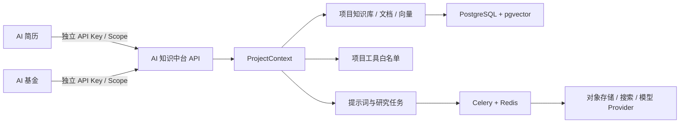
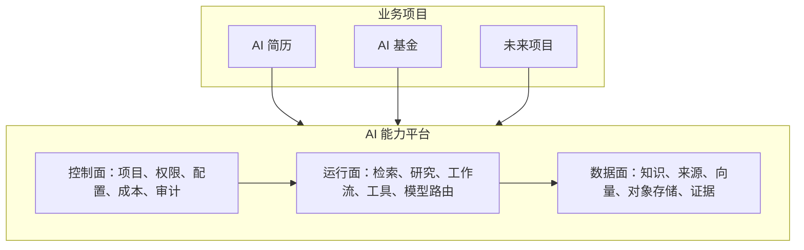
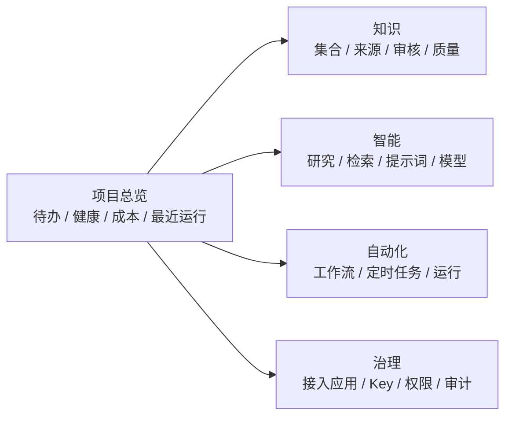

# AI 知识中台整合改造 PRD

| 项目 | 内容 |
| --- | --- |
| 文档状态 | 规划基线，待产品决策确认后实施 |
| 产品名称 | AI 知识中台（Knowledge Hub） |
| 服务对象 | AI 简历、AI 基金及后续业务项目 |
| 当前版本 | v1.0（2026-08-09） |
| 事实来源 | 当前 React/FastAPI 代码、Alembic 初始迁移、Docker 配置与既有 MVP 文档 |

## 1. 目标与结论

将现有“智能知识中台”演进为各业务项目共享的知识与研究基础设施，而非将 AI 简历、AI 基金合并成一个业务系统。平台统一提供项目隔离、知识生命周期、检索、研究编排、采集、提示词、工具治理、异步任务和审计；业务项目继续拥有自己的用户、业务数据、页面与领域规则。

当前代码已经具备项目级隔离、知识库/文档/分块、混合检索、研究任务、采集、调度、工具和提示词等骨架。改造第一要务是补齐“可运行、可观测、可接入”的闭环，并冻结跨项目契约；不先扩张新的业务功能。

## 2. 现状基线

### 2.1 已具备能力

- 前端：React 19 + TypeScript + Vite，项目维度的知识库、文档、研究、检索测试、采集、任务、工具、提示词、API Key 与设置页面已存在。
- 后端：FastAPI，统一响应、请求 ID、异常处理、API Key 鉴权、Scope 校验、项目上下文、限流和脱敏日志已实现。
- 数据：PostgreSQL + pgvector，`projects`、`api_keys`、知识库、文档、分块、研究、采集、调度、工具、提示词、审计等模型及初始 Alembic 迁移已存在。
- 异步：Celery 拆分为 `online`、`ingestion`、`crawler`、`maintenance` 队列；文档入库、采集、异步研究和定时调度已有任务入口。
- 隔离：项目资源以 `ProjectContext` 和 `project_id` 约束；知识库/文档/分块保留项目一致的复合外键；已有隔离、检索隔离、工具隔离、SSRF 和调度幂等测试。

### 2.2 不能作为已上线能力的缺口

| 范畴 | 当前事实 | 改造要求 |
| --- | --- | --- |
| 可用性 | `/ready` 仍是固定成功响应 | 探测数据库、Redis、对象存储及队列的真实就绪状态 |
| 前后端契约 | 统计接口未实现；网络资料审核前端已调用而后端未提供；项目设置载荷结构不一致 | 建立 OpenAPI/契约测试，按版本冻结 API |
| 数据工具 | 基金、指数、职位、商品、财经新闻 Handler 含 Mock/占位实现 | 先定义 Provider 契约、数据许可与失败降级，再接真实数据源 |
| 调度维护 | `tool_sync`、重建索引、知识过期清理等任务未完成 | 仅暴露已实现任务类型；补齐其余任务及重试/死信/告警 |
| 存储与安全 | S3 Provider 预留；CORS 当前允许全部来源 | 生产环境配置白名单、密钥轮换、对象存储加密与生命周期 |
| 观测 | 有日志与部分执行记录，但缺少统一指标和运营视图 | 建立请求、队列、检索、模型、采集、成本的可观测性 |

## 3. 产品边界

### 3.1 平台负责

- 项目、应用凭证、Scope、限流、审计和配额。
- 业务隔离的知识库、文档上传/采集、解析、分块、Embedding、版本与保留策略。
- 关键词 + 向量混合检索、证据化研究、联网研究和结构化结果。
- 可治理的工具定义、项目工具白名单、提示词版本和异步任务编排。
- 接入 SDK/HTTP API、健康检查、监控、错误语义和回放能力。

### 3.2 业务项目负责

- AI 简历：账号与简历数据、字段模型、模板/编辑器、简历生成和投递业务。
- AI 基金：账户与持仓、交易/净值业务、风险提示、用户投资偏好和合规展示。
- 业务项目自己的支付、用户权限、前端体验及对外承诺。

### 3.3 明确不做

- 不把业务库复制进知识中台，不以知识中台替代简历或基金的主数据库。
- 不因“共享平台”默认开放跨项目检索、知识复制或工具调用。
- 不把真实基金投资建议、交易指令或招聘决策自动化为无人工确认的行为。

## 4. 目标架构与隔离模型

1. 每个业务域创建独立 `project`，例如 `ai-resume` 与 `ai-fund`。
2. 每个 `project` 独立配置 API Key、Scope、模型/限额、域名策略、知识库、提示词版本、工具白名单和审计记录。
3. 业务调用仅从 Bearer API Key 生成 `ProjectContext`；客户端传入的项目 ID 或项目编码只能用于一致性校验，不得覆盖身份。
4. Repository、异步 Worker 和存储路径均以 `project_id` 为强制边界；跨项目资源返回不泄露存在性的错误。
5. “共享知识”不等于共用数据表访问：未来需通过显式发布、版本、来源、授权范围、同步方向和撤销机制实现，只读订阅优先。

## 5. 核心用户旅程

### 5.1 AI 简历接入

1. 管理员创建 `ai-resume` 项目、最小 Scope 的服务 Key 与独立知识库。
2. 简历系统上传岗位描述、行业资料、用户授权的简历内容或由业务侧传入受控摘要。
3. 简历系统调用检索/研究接口，获得带来源、置信信息与请求 ID 的岗位匹配建议。
4. 简历系统在自身 UI 中展示、编辑、确认结果；中台只保存已授权的知识资产与审计信息。

### 5.2 AI 基金接入

1. 管理员创建 `ai-fund` 项目，配置受许可的数据 Provider、风险标签、数据刷新策略和工具白名单。
2. 基金系统把公开研究材料、受许可行情快照、产品规则写入独立知识库。
3. 系统按计划采集/刷新，并将异常、来源、时间戳和数据版本写入审计。
4. 基金系统请求证据化研究结果；输出必须标识数据时点、来源和“非投资建议”业务责任，由业务系统展示。

## 6. 功能需求

### P0：平台可接入、可隔离、可运行

| 编号 | 需求 | 验收标准 |
| --- | --- | --- |
| P0-01 | 项目接入治理 | 能创建/停用项目和最小权限 API Key；Key 明文只返回一次，服务端只存哈希 |
| P0-02 | API 契约统一 | 前端、OpenAPI、Pydantic Schema 与错误码一致；提供版本号、弃用策略与契约测试 |
| P0-03 | 强隔离回归 | 项目 A 无法读写项目 B 的知识、任务、采集、工具与结果；同步/异步链路均覆盖测试 |
| P0-04 | 知识闭环 | 文件、文本、URL 和审核通过的采集资料可入库、可查询状态、可重试、可检索 |
| P0-05 | 真实就绪检查 | `/health` 仅表示进程存活；`/ready` 必须检查数据库、Redis、对象存储/任务依赖并给出可诊断状态 |
| P0-06 | 生产配置基线 | CORS 白名单、Secret 管理、环境分层、备份/恢复、日志脱敏、API Key 轮换和基础限流可配置 |

### P1：业务接入能力

| 编号 | 需求 | 验收标准 |
| --- | --- | --- |
| P1-01 | AI 简历适配器 | 提供岗位匹配、公司/行业研究的请求模型、结果结构和幂等键示例；不耦合简历模板逻辑 |
| P1-02 | AI 基金适配器 | Provider 标准化输出数据来源、时点、许可、质量状态；禁用 Mock 数据进入生产研究链路 |
| P1-03 | 工具治理 | 项目白名单、Scope、参数 Schema、超时、重试、调用审计和模拟测试完整闭环 |
| P1-04 | 采集与审核闭环 | 采集源、运行、页面、资料池审核、入库和退回均有一致 API 与 UI；保留来源和内容哈希 |
| P1-05 | 调度任务完整化 | 仅发布已实现任务；补齐工具同步、重建索引、知识过期处理、取消、重试和告警 |

### P2：规模化与共享知识

| 编号 | 需求 | 验收标准 |
| --- | --- | --- |
| P2-01 | 显式共享知识 | 支持“发布者项目—订阅者项目”只读授权、版本、撤销、溯源和使用审计 |
| P2-02 | 评估体系 | 检索命中、证据完整度、回答质量、延迟、成本和业务反馈可按项目追踪 |
| P2-03 | 成本与配额 | 模型、Embedding、网络搜索、工具、存储成本按项目统计与限制 |
| P2-04 | 高可用 | 队列死信、任务补偿、索引重建、数据归档、横向扩容和灾备演练完成 |

## 7. 外部 API 契约

### 7.1 统一约定

- 基础路径：`/api/v1`，升级使用新主版本，不在同一版本内破坏字段语义。
- 鉴权：`Authorization: Bearer <project-api-key>`；可选 `X-Project-Code` 必须与 Key 归属项目一致。
- 追踪：客户端可传 `X-Request-Id`；所有响应返回请求 ID。
- 写请求：支持 `Idempotency-Key` 的接口须对相同键和相同载荷重放结果，对不同载荷返回冲突。
- 输出：研究/检索结果必须包含来源、创建时间、数据版本或时点；失败返回稳定业务错误码与 `retryable`。

### 7.2 AI 简历最小 Scope

- `knowledge:read`：岗位、行业和用户已授权资料检索。
- `knowledge:write`：经用户授权的文本/文件写入。
- `research:run`：岗位匹配和公司研究。
- 禁止默认授予基金市场工具和其他项目资源。

### 7.3 AI 基金最小 Scope

- `knowledge:read` / `knowledge:write`：基金资料、公开研究材料及受许可数据的知识化。
- `research:run`：证据化研究，不代表自动投资执行授权。
- `tools:execute`：只允许在项目白名单内调用行情、指数、财经新闻等工具。
- 结果增加 `asOf`、`source`、`license`、`dataQuality` 与风险提示字段；数据时点缺失时禁止以实时结论展示。

## 8. 数据、合规与安全

- 简历内容按个人信息处理：仅存用户已授权的数据，支持项目内删除、保留期与访问审计；日志不得记录全文。
- 基金数据按 Provider 许可、市场延迟和地区规则使用；将数据来源、抓取时间和版本保留为可审计元数据。
- 所有密钥进环境/Secret 管理，不进入数据库明文字段、前端包、PRD、Skill 或日志。
- 采集链路继续执行 SSRF、DNS 重绑定、私网地址、重定向和域名白/黑名单保护。
- 生产环境最小权限、网络分段、加密备份和恢复演练为上线门槛。

## 9. 实施路线图

| 阶段 | 目标 | 主要交付 |
| --- | --- | --- |
| 0. 契约冻结 | 确认边界和真实现状 | 本 PRD、API 差异清单、项目编码/Scope 清单、验收用例 |
| 1. 平台修复 | 修复不能运行或不一致的路径 | `/ready`、统计与审核 API、项目设置契约、前端适配、契约测试 |
| 2. 业务接入 | 接通 AI 简历和 AI 基金最小闭环 | 两套独立项目配置、适配器、端到端隔离测试、接入示例 |
| 3. 数据与调度 | 可靠获取、处理和维护知识 | 真实 Provider、调度任务、失败补偿、数据质量与来源治理 |
| 4. 运营扩展 | 规模化运行 | 指标/告警、配额成本、共享知识授权、高可用与灾备 |

## 10. 验收与上线门槛

1. AI 简历与 AI 基金使用不同 Key 时，任何检索、研究、采集、工具和异步任务均不可跨项目访问。
2. 两个项目可分别完成“写入知识 → 异步入库 → 检索 → 研究 → 审计”的端到端流程。
3. 前端页面发出的每个正式请求均有后端实现、Schema 和错误处理；不存在以 404/501 容错掩盖的正式功能。
4. 业务工具在生产环境使用真实、授权的数据 Provider；Mock 只能用于明确标注的开发/测试环境。
5. 就绪检查、日志脱敏、失败告警、任务重试、备份与关键指标通过环境验证。
6. 新增功能按 `maintain-ai-knowledge` 的 `--更新` 流程同步架构、契约和维护记录。

## 11. 待你确认的产品决策

以下选择会实质影响数据模型、权限和交付范围，在开始业务改造前需要确认：

1. AI 简历与 AI 基金是否各自使用独立用户体系，还是将来需要统一账号/组织体系？
2. “共享知识”第一期是否完全禁止，还是需要指定的只读公共知识库？若需要，谁可以发布、订阅和撤销？
3. AI 基金接入的数据源、数据许可、刷新频率和合规免责声明由谁确定？
4. 知识中台将部署在单机 Docker、云容器平台还是现有项目的服务器？这决定 Secret、对象存储、队列与监控方案。
5. 第一阶段优先打通 AI 简历还是 AI 基金？建议先以 AI 简历完成低风险接入闭环，再接入受数据许可约束更强的 AI 基金。

## 12. 总体改造方案：从知识后台到 AI 能力平台

### 12.1 产品定位升级

产品更名建议为 **AI 能力平台**，知识库是其中一个核心能力而非全部。它向 AI 简历、AI 基金及未来项目交付“可配置、可审计、可复用、可隔离”的底层 AI 服务。

平台不统一接管各业务项目的用户和业务数据；它提供统一的能力控制面、运行面与数据面。任何新项目接入时只需创建项目空间、选择能力包、配置凭证和数据边界，即可开始使用。

### 12.2 三层能力模型

| 层级 | 核心对象 | 现有基础 | 改造目标 |
| --- | --- | --- | --- |
| 控制面 | 工作空间、项目、应用、API Key、Scope、配额、审计 | `projects`、API Key、项目设置、日志 | 新增项目模板、能力开关、环境、成本/预算、接入应用与密钥生命周期 |
| 运行面 | 检索、研究、提示词、工具、工作流、任务、模型策略 | research、prompts、tools、Celery、schedules | 收敛为可组合“能力包”，统一输入/输出、执行轨迹、重试、降级与版本 |
| 数据面 | 知识集合、来源、文档、片段、向量、证据、保留策略 | 知识库、文档、pgvector、采集资料 | 增加数据分级、版本、来源、保留期、显式共享和数据质量 |

### 12.3 接入模型

一个业务系统对应一个项目空间；一个项目空间可拥有多个“接入应用”（Web、后端服务、定时任务）。接入应用拥有独立 Key 和最小 Scope，避免一个泄露的 Key 获得整套项目能力。

| 接入项目 | 首期能力包 | 数据边界 | 不可越过的边界 |
| --- | --- | --- | --- |
| AI 简历 | 岗位/行业知识、岗位匹配研究、文档解析、反馈评估 | 用户授权的简历资料、岗位资料 | 不读取基金数据，不将简历原文用于其他项目训练或检索 |
| AI 基金 | 市场资料、公告/研报知识、证据研究、合规工具与定时刷新 | 已授权的公开资料及许可数据 | 不输出未经标注时点/来源的结论，不使用简历项目的数据 |
| 新项目 | 从“通用知识”“联网研究”“工具调用”“工作流”选择能力包 | 独立知识、模型、预算、审计 | 默认无共享；共享须经过发布/订阅授权 |

### 12.4 能力包设计

不再让新项目直接面对全部菜单和底层表，而是由平台发布能力包：

- **知识助手**：知识集合、文件/URL 写入、异步解析、引用检索。
- **证据研究**：多源检索、联网采集、证据合并、结构化结论、反馈闭环。
- **受控工具**：工具目录、参数 Schema、白名单、超时、调用日志与模拟测试。
- **自动化**：定时刷新、触发器、异步任务、失败重试、通知与运行记录。
- **AI 治理**：提示词版本、模型策略、配额、成本、内容安全、审计和回放。

每个能力包提供：启用条件、所需 Scope、输入/输出 Schema、异步状态、失败语义、审计事件、配额计量和 SDK 示例。

## 13. 信息架构与视觉改造方案

### 13.1 信息架构重构

现有项目侧栏将知识、采集、任务、工具、提示词、API Key 等 15 项直接平铺，学习成本高。改为五个有层级的工作区，二级功能在页面内以标签或抽屉承载：

| 一级工作区 | 页面与动作 | 适用对象 |
| --- | --- | --- |
| 总览 | 项目健康、近期运行、成本、待处理项、快捷开始 | 项目负责人 |
| 知识 | 知识集合、来源、文档、采集、审核、质量 | 内容运营/业务人员 |
| 智能 | 研究台、检索调试、提示词、模型策略、结果评估 | AI 产品/算法人员 |
| 自动化 | 工作流、定时任务、运行记录、失败重试 | 运营/工程人员 |
| 治理 | 接入应用、API Key、工具授权、成员、配额、审计与项目设置 | 管理员 |

全局层只保留“工作空间切换、项目目录、平台健康、通知、个人设置”；项目切换使用可搜索的项目选择器，而不是页面跳转后才发现当前项目上下文丢失。

### 13.2 视觉语言

界面定位为“专业但温和的 AI 控制台”，避免传统后台满屏表格和拥挤的菜单。

- **布局**：左侧紧凑导航 + 顶部项目上下文 + 内容区 12 栅格；宽屏采用双栏信息卡，移动端收叠为单栏。
- **色彩**：深墨蓝/石墨灰作为秩序底色，靛蓝作为主操作色；AI 简历用青蓝辅助色、AI 基金用青绿色辅助色，只用于项目识别而非全页染色。
- **层次**：概览页优先展示“下一步动作、异常、运行状态、结果摘要”，表格下沉至详情页；空状态必须给出可执行入口。
- **可读性**：中文优先字体、16px 正文、清晰数字层级；对长研究结果使用来源卡片、时间线和可折叠证据，不直接堆叠大段文本。
- **反馈**：异步任务以步骤时间线、进度、可重试原因展示；危险操作采用影响范围预览和二次确认。

### 13.3 关键页面蓝图

## 14. 目标技术改造方案

### 14.1 后端

1. 保持 FastAPI、SQLAlchemy async、PostgreSQL/pgvector、Redis、Celery 的既有技术栈，避免为“重做”而替换成熟基础。
2. 按领域将现有 API/Worker 进一步收敛为 `control-plane`、`knowledge`、`intelligence`、`automation`、`governance` 五个边界；路由薄、服务编排、Repository 持久化的分层不变。
3. 新增应用注册与能力开关，令 API Key 绑定接入应用、环境、Scope、预算和可调用能力，而非只绑定项目。
4. 为每项异步能力定义统一 Run 状态：`queued/running/succeeded/failed/cancelled/degraded`，并保留输入摘要、输出引用、成本、错误码和可重试性。
5. 建立 Provider 接口：模型、Embedding、搜索、行情/职位等数据工具均只能以标准契约接入；Mock 只允许测试环境。

### 14.2 数据库

保持现有项目级隔离模型，在不破坏当前数据的前提下分批增加：

- `applications`：项目内接入应用、环境和能力包绑定。
- `capability_grants`：应用/Key 的能力与 Scope 授权。
- `knowledge_sources` / `knowledge_versions`：来源、版本、内容哈希、数据等级和保留期。
- `shared_knowledge_grants`：发布者、订阅者、只读范围、版本与撤销记录。
- `execution_runs` / `usage_metrics`：统一执行轨迹、耗时、模型/工具用量和成本。

所有新增子表继续以 `project_id` 为过滤与复合外键的一部分；共享必须通过授权记录复制“可读权限”，而不是移除项目过滤。

### 14.3 前端

1. 用“能力包 + 工作区”重构路由和导航，不再将后端表逐个映射成菜单。
2. 引入统一页面框架：标题区、上下文/筛选区、主要工作区、辅助信息区、空状态和骨架屏。
3. 先建立设计令牌（颜色、间距、圆角、阴影、状态色、字体）与基础组件（指标卡、状态标签、空状态、运行时间线、证据卡、危险操作确认），再迁移现有页面。
4. 统一请求封装和 TypeScript API 类型；生成或校验 OpenAPI 类型，消除当前 Axios 响应层和表单类型的构建错误。

### 14.4 运维与质量

- 开发 Compose 用于 PostgreSQL/Redis；完整服务编排使用统一 Compose/Kubernetes 清单，生产 Secret 不再硬编码于仓库。
- 将 `/ready` 改为真实依赖检查，提供结构化健康状态，不把“进程存活”误作为“服务可用”。
- 补齐前后端契约测试、隔离回归、关键任务状态机测试和真实 Provider 的沙箱测试。
- 建立指标：请求量/失败率、队列堆积、入库成功率、检索命中、模型延迟、工具错误、项目成本与预算告警。

## 15. 分阶段实施计划

| 阶段 | 目标 | 主要产出 | 完成标准 |
| --- | --- | --- | --- |
| A. 设计与契约 | 冻结平台模型与视觉基线 | 设计令牌、信息架构、OpenAPI 差异清单、能力包目录 | 业务方能依据统一契约接入，不再以页面猜接口 |
| B. 平台可用性 | 先修复基础闭环 | 构建错误修复、真实 `/ready`、统计/审核/设置接口一致性、运行记录统一 | 前端可构建；正式功能无 404/Mock 掩盖 |
| C. 控制面升级 | 面向多项目管理能力 | 应用注册、能力开关、Key/Scope/预算、治理工作区 | AI 简历与 AI 基金可独立配置、审计和限额 |
| D. 知识与智能升级 | 形成可复用能力包 | 知识来源/版本、研究结果结构化、工具 Provider、评估反馈 | 两项目各自完成端到端知识与研究闭环 |
| E. 自动化与运营 | 可靠运行并可扩展 | 工作流、任务补偿、告警、成本、共享授权 | 新项目在不改平台核心代码的前提下完成接入 |

实施顺序遵循“先设计系统与契约，再重构界面，再扩展能力”。AI 简历适合作为第一条接入样板；AI 基金在真实数据 Provider、时点/许可和风险声明确定后进入第二条样板。

## 16. 本轮方案确认项

在开始改造前，请确认以下方向：

1. 产品名称是否采用“AI 能力平台”，还是继续沿用“智能知识中台”？
2. 第一阶段是否优先完成“控制台美化 + 信息架构重构 + 前后端契约修复”，暂不引入统一账号体系？
3. 是否以 AI 简历为首个接入样板，AI 基金作为第二阶段？
4. 未来项目是否允许使用显式发布的公共知识，还是首期完全项目隔离？
