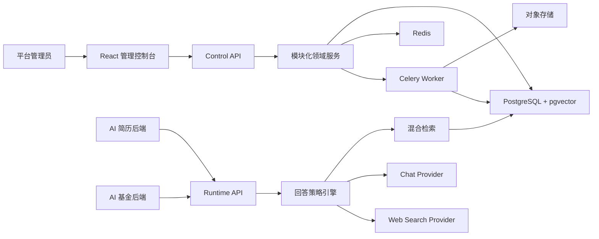
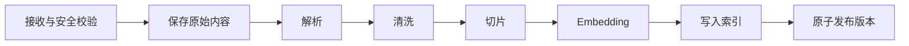

# AI 知识能力底座架构

本文件描述当前项目实现。产品范围与验收标准以 [PRD](./PRD.md) 为唯一业务基线。

## 1. 总体结构

当前采用模块化单体，而不是一开始拆成多个微服务。应用、知识、检索、回答和运行治理仍有强事务关系，模块化单体更容易保证隔离、迁移和故障诊断；后续只有在容量或组织边界明确时才拆分独立服务。

## 2. 目录职责

| 路径 | 职责 |
| --- | --- |
| `frontend/apps/console` | 管理控制台、错误展示、Playground、运行中心 |
| `frontend/packages/contracts` | TypeScript 契约和 OpenAPI 快照 |
| `frontend/packages/ui` | 共享页面状态和视觉组件 |
| `frontend/infrastructure/nginx` | 前端静态资源与 API 反向代理配置 |
| `backend/services/api` | 控制面、运行面、领域服务、Provider、数据库迁移 |
| `backend/services/worker` | Celery Worker 镜像入口 |
| `backend/infrastructure/postgres` | PostgreSQL 初始化配置 |
| `backend/scripts` | OpenAPI 契约导出工具 |

项目目录与能力边界见 [项目梳理](./项目梳理.md)。

## 3. 隔离模型

数据最高边界是 `application_id`，第二边界是 `environment_id`。知识集合、来源、文档、版本、片段、策略、API Key、运行轨迹、证据、反馈和审计事件全部携带这两个字段。

运行面不接收可覆盖身份边界的 `applicationId` 或 `environmentId`。服务端从 Bearer API Key 中解析应用与环境上下文，再将上下文注入查询。关键父子关系使用复合外键，防止只靠业务代码过滤。

## 4. 控制面与运行面

- 控制面前缀：`/control/v1`。
- 运行面前缀：`/runtime/v1`。
- 控制面使用管理员 HttpOnly Session。
- 运行面使用按应用环境签发的 API Key 与 Scope。
- API Key 明文仅创建时返回一次，数据库只保存 Argon2id 哈希。
- 所有响应和错误都返回 `requestId`，响应头同步返回 `X-Request-Id`。

## 5. 知识入库

文件、文本、公开网页、JSON API、RSS/Atom、XML 和 CSV 最终进入同一流水线。远程数据由 Worker 异步抓取，创建任务不会被慢网站阻塞：

新版本发布成功前，文档的 `current_version` 仍指向旧版本。失败任务记录阶段、稳定错误码、中文错误说明、处理建议、请求 ID 和重试次数，可从安全入口重新排队。远程地址拒绝内网、回环、保留地址、URL 凭证与敏感参数；允许最多 5 次安全重定向，但每一跳都会重新检查目标地址，并拒绝 HTTPS 降级到 HTTP。

## 6. 检索与回答

检索组合 pgvector 余弦分数与 `pg_trgm` 文本相似度，并在数据库查询阶段过滤应用、环境、集合状态、文档当前版本和元数据。合并后执行最低分过滤，并限制单文档最多三个片段。

回答策略根据证据数量、分数、时效、模型和联网 Provider 可用性，显式返回：

- `KNOWLEDGE_GROUNDED`
- `HYBRID`
- `MODEL_ONLY`
- `WEB_GROUNDED`
- `INSUFFICIENT_EVIDENCE`
- `DEGRADED`

模型输出使用 Draft 2020-12 JSON Schema 校验。临时输入只进入本次模型上下文，不写入知识库或运行日志。引用由服务端根据实际证据生成，模型无权伪造引用对象。

## 7. 可观测与故障治理

- `/health` 只表示 API 进程存活。
- `/ready` 分别检查数据库、Redis、Worker、Chat、Embedding 和搜索 Provider。
- 请求轨迹记录回答模式、证据数、降级原因、耗时和 Token。
- 运行中心可按状态、错误码和时间查询，并按 `requestId` 查看证据详情。
- 归档操作写入应用环境级审计事件。

## 8. 部署边界

根目录 `docker-compose.yml` 面向本地和单机验证。API 启动前自动执行 Alembic；Worker 等待 API 健康后启动。生产环境必须使用外部密钥管理、HTTPS、备份、独立数据库与 Redis，并通过配置校验：

- 禁止示例密码和示例会话密钥。
- 必须启用 Secure Cookie。
- 禁止开发用 `local_hash` Embedding。
- 必须配置 Chat Provider。
- 生产 CORS 禁止通配符。

## 9. 后续扩展点

P1 的定时同步、加密凭证、业务工具和质量评测沿用应用环境边界，不改变运行面基础契约。工具必须先注册、再授权给环境和回答策略；AI 基金的实时行情只能来自具备时效和来源声明的工具或联网证据，不能由模型常识代替。
